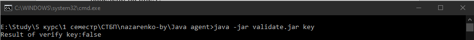
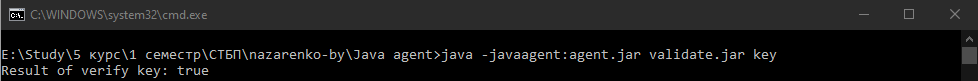

###### Назаренко Б.Є., КІТ М120Б

# JAVA-АГЕНТИ

Лабораторна робота

**Мета** : Дослідити можливості java-агентів.

**Індивідуальне завдання:**

Використовуючі механізм java-агентів, виконати наступні дії:

- «підключитися» до додатку &quot;клієнта&quot; до етапу завантадення класів

- вивести статистику завантажених класів: завантажених класів самого додатку, завантажених класів jre, завантажених класів викоритованих зовнішніх бібліотек (якщо такі є)

- виконати підміну публичного ключа (не модифікаючи сам файл ключа)

Після виконання описаних кроків вдосконалитись, що ліцензійний ключ, створений у розділі &quot;пререквізити&quot; є тепер валідним

ХІД РОБОТИ

Загалом, java-агент - це просто спеціально створений jar-файл. Він використовує Instrumentation API, який JVM надає для зміни існуючого байт-коду, який завантажується в JVM.

Кожному агенту Java потрібен хоча один із методів premain або agentmain. Останній використовується для динамічного завантаження, тоді як перший використовується для статичного завантаження Java-агента в JVM. premain - буде статично завантажувати агент за допомогою параметра -javaagent

при запуску JVM \*\* agentmain - динамічно завантажує агент в JVM, використовуючи Java Attach API

Слід мати на увазі, що реалізація JVM, така як Oracle, OpenJDK і інші, може забезпечити механізм для динамічного запуску агентів, але це не є обов&#39;язковою вимогою.

По-перше, давайте подивимося, як ми будемо використовувати існуючий агент Java.

Після цього ми розглянемо, як ми можемо створити його з нуля, щоб додати функціональність, необхідну нам в нашому байт-коді.

Щоб мати можливість використовувати агент Java, ми повинні спочатку завантажити його.

У нас є два типи навантаження:

static - використовує premain для завантаження агента за допомогою -javaagent

dynamic - використовує agentmain для завантаження агента в JVM використовуючи Java Attach API.

Завантаження агента Java при запуску програми називається статичної завантаженням. Статична завантаження змінює байт-код під час запуску перед виконанням будь-якого коду.

Cтатичне завантаження використовує метод premain, який буде запущений до запуску будь-якого коду програми, для його запуску ми можемо виконати:

java -javaagent: agent.jar -jar application.jar

Лістинг підміни функції валідації ключа:
```
public class VerifyTransformer implements ClassFileTransformer {

@Override

public byte[]transform(

ClassLoader loader,

String className,

Class\&lt;?\&gt; classBeingRedefined,

ProtectionDomain protectionDomain,

byte[]classfileBuffer) {

byte[]byteCode = classfileBuffer;

String finalTargetClassName = this.targetClassName

.replaceAll(&quot;\\.&quot;, &quot;/&quot;);

if (!className.equals(finalTargetClassName)) {

return byteCode;

}

if (className.equals(finalTargetClassName)

&amp;&amp; loader.equals(targetClassLoader)) {

try {

ClassPool cp = ClassPool.getDefault();

CtClass cc = cp.get(targetClassName);

CtMethod m = cc.getDeclaredMethod(&quot;verify&quot;);

m.addLocalVariable(

&quot;result&quot;, true);

m.insertBefore(

&quot;return result;&quot;);

byteCode = cc.toBytecode();

cc.detach();

} catch (NotFoundException | CannotCompileException | IOException e) {

LOGGER.error(&quot;Exception&quot;, e);

}

}

return byteCode;

}

}
```
Виконаємо валідацію ключа без використання агента. Результат наведено на рис.1.



Рисунок 1 – Результат

Виконаємо валідацію того ж ключа з використанням агента. Результат наведено на рис.2.



Рисунок 2 – Результат підміни

Агент підміняє значення, що повертає функція verify().

**Висновки:** в ході лабораторної работи було досліджено можливості java-агентів.