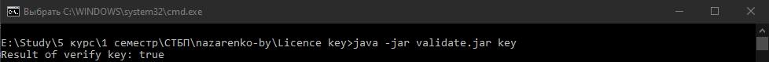

######Назаренко Б.Є., КІТ М120Б

#СТВОРЕННЯ ЛІЦЕНЗІЙНОГО КЛЮЧА

Лабораторна робота

**Мета** : Дослідити і порівняти існуючі механізми створення і перевірки валідності ліцензійних ключів.

**Індивідуальне завдання:**

Дослідити і порівняти існуючі механізми створення і перевірки валідності ліцензійних ключів.

ХІД РОБОТИ

Більшість програм використовують систему серійних номерів / кодів реєстрації, щоб дозволити кінцевим користувачам розблокувати або активувати свою покупку. Проблема, з якою стикаються більшість із нас, полягає в тому, що через кілька днів або тижнів після випуску нашого програмного забезпечення хтось розробив кейген, зламав чи випустив серійний номер через Інтернет.

Існує кілька можливих рішень цієї проблеми. Ви можете ліцензувати таку систему, як Armadillo / Software Passport або ASProtect, або ж розповсюдити окрему повну версію для завантаження для своїх платників. Кожен варіант має переваги та недоліки. Те, що я збираюся показати вам, - це спосіб продовжувати «прокручувати власну» систему ліцензійних ключів, одночасно ускладнюючи виробництво робочих тріщин, а робочі кейгени - у минулому.

Наша система ліцензійних ключів повинна відповідати деяким основним вимогам.

Ключі ліцензії повинні бути досить простими для введення.

Ми повинні мати можливість включити в чорний список (анулювати) ліцензійний ключ у разі повернення платежів або покупок з викраденими кредитними картками.

Немає &quot;дзвінка додому&quot; для тестування ключів. Хоча ця практика стає дедалі поширенішою, я все ще не ціную її як користувача, тому не буду просити своїх користувачів миритися з нею.

Зломщик не повинен мати можливості розібрати наш випущений додаток і створити з нього діючий «кейген». Це означає, що наш додаток не буде повністю перевіряти ключ для перевірки. Перевіряється лише частина ключових. Крім того, кожен випуск програми повинен перевіряти іншу частину ключа, щоб фальшивий ключ, заснований на попередньому випуску, не працював у наступному випуску нашого програмного забезпечення.

Важливо: законний користувач не повинен випадково вводити недійсний ключ, який, здається, працює, але не працює в майбутній версії через друкарську помилку.

Рішення називається система часткової перевірки ключа, оскільки ваше програмне забезпечення ніколи не тестує повний ключ. Оскільки ваша програма не містить коду для тестування кожної частини ключа, зломщику неможливо створити діючий дійсний генератор ключів, просто розібравши виконуваний код.

Наша програма генерує ліцензійний ключ, додаючи ЕЦП.

Лістинг генерації ключа:
```

byte[] digestionat = Utils.digestiona(f,&quot;MD5&quot;);

Random random = new Random();

byte[] key = new byte[20];

random.nextBytes(key);

byte[] encryptdigestionat = Utils.sign(digestionat, prik);

Utils.write(FITXER\_SIGNAT,encryptdigestionat, key);

Лістинг створення підпису:

public static byte[] sign(byte[] digest, PrivateKey pk){

byte[] res = null;

try {

Cipher key = Cipher.getInstance(&quot;RSA&quot;);

key.init(Cipher.ENCRYPT\_MODE, pk);

res = key.doFinal(digest);

} catch (Exception e) {

e.printStackTrace();

}

return res;

}
```

Валідація ключа відбувається методом валідації підпису. Результат валідації навдено на рис. 1.



Рисунок 1 – Результат

**Висновки:** в ході лабораторної работи було досліджено механізм створення і перевірки валідності ліцензійних ключів.