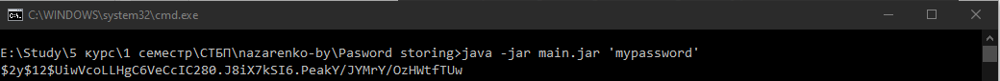

###### Назаренко Б.Є., КІТ М120Б

# ЗБЕРІГАННЯ ПАРОЛІВ

Лабораторна робота

**Мета** : Дослідити і порівняти існуючі механізми зберігання паролів

**Індивідуальне завдання:**

Дослідити існуючі механізми зберігання паролю. Зробити порівняльну характеристику кожного механізму. Реалізувати механізм зберігання паролю та продемонструвати процес аутентифікації. Довести що даний метод оптимальний.

ХІД РОБОТИ

Розглянемо декілька механізмів зберігання паролів: MD5, SHA256, SHA512, PBKDF2, BCrypt.

Алгоритм MD5 - це широко використовувана криптографічна хеш-функція, яка виробляє 128-бітове (16-байтове) хеш-значення. Це дуже просто і прямо вперед; основна ідея полягає у відображенні наборів даних змінної довжини в наборах даних фіксованої довжини.

Для цього вхідне повідомлення розбивається на шматки 512-бітових блоків. До кінця додається відступ, щоб його довжину можна було поділити на 512. Тепер ці блоки обробляються алгоритмом MD5, який працює у 128-бітному стані, і результатом буде 128-бітове хеш-значення. Після застосування MD5 генерований хеш зазвичай є 32-значним шістнадцятковим числом.

Хоча MD5 є широко розповсюдженим алгоритмом хешування, але це далеко не безпечно, MD5 генерує досить слабкі хеші. Головними перевагами є те, що він швидкий і простий у реалізації. Але це також означає, що він сприйнятливий до грубої сили та словникових атак.

Веселкові таблиці зі сформованими словами та хешами дозволяють дуже швидко шукати відомий хеш і отримувати вихідне слово.

MD5 не є стійким до зіткнень, що означає, що різні паролі в кінцевому підсумку можуть мати один і той же хеш.

Сьогодні, якщо ви використовуєте хеш MD5 у своєму додатку, то подумайте про додавання солі для своєї безпеки.

SHA (Secure Hash Algorithm) - це сімейство криптографічних хеш-функцій. Він дуже схожий на MD5, за винятком того, що генерує більш сильні хеші. Однак ці хеші не завжди є унікальними, і це означає, що для двох різних входів ми могли б мати рівні хеші. Коли це трапляється, це називається &quot;зіткненням&quot;. Шанси зіткнення в SHA менше, ніж MD5. Але, не турбуйтеся про ці зіткнення, оскільки вони дійсно дуже рідкісні.

Вони генерують наступні хеші довжини порівняно з MD5 (128-бітний хеш):

SHA-1 (найпростіший - хеш 160 біт)

SHA-256 (сильніший за SHA-1 - 256-бітний хеш)

SHA-384 (сильніший за SHA-256 - 384 біти хеш)

SHA-512 (сильніший за SHA-384 - 512-бітний хеш)

Більш довгий хеш важче зламати. Це основна ідея.

Наразі ми дізналися про створення безпечних хеш-кодів для пароля та використання солі, щоб зробити його ще більш безпечним. Але проблема сьогодні в тому, що апаратні засоби стали настільки швидкими, що будь-яка атака грубої сили за допомогою словникових та райдужних таблиць, будь-який пароль може бути зламана за якийсь менший або більший час.

Щоб вирішити цю проблему, загальна ідея полягає в тому, щоб зробити атаку грубої сили повільнішою, щоб пошкодження було мінімізовано. Наш наступний алгоритм працює над цією самою концепцією. Мета полягає в тому, щоб зробити хеш-функцію досить повільною, щоб перешкоджати атакам, але все-таки досить швидко, щоб не спричинити помітної затримки для користувача.

По суті, ця функція реалізована за допомогою деяких інтенсивних процесорів, таких як PBKDF2, Bcrypt або Scrypt. Ці алгоритми беруть як аргумент коефіцієнт роботи (також відомий як коефіцієнт безпеки) або підрахунок ітерацій. Це значення визначає, наскільки повільною буде хеш-функція. Коли комп&#39;ютери стануть швидшими в наступному році, ми зможемо збільшити коефіцієнт роботи, щоб збалансувати його.

Загалом можно зробити наступні висновки:

- MD5 забезпечує базове хешування для створення безпечного хешу паролів. Додавання солі робить його ще сильнішим.
- MD5 генерує 128-бітний хеш. Щоб зробити більш безпечним, використовуйте алгоритм SHA, який генерує хеші довжиною від 160 до 512 біт. 512-біт найсильніший.
- Навіть хешовані безпечні паролі SHA можна зламати за допомогою сучасних швидких апаратних засобів. Щоб перемогти це, вам знадобляться алгоритми, які можуть зробити атаки грубої сили повільнішими та мінімізувати вплив. Такими алгоритмами є PBKDF2, BCrypt та SCrypt.

Отже для реалізації механізму зберігання паролів bcrypt. Це адаптивна криптографічний хеш-функція формування ключа, що використовується для захищеного зберігання паролів. Розробники: Нільс Провос і David Mazières. Функція заснована на шифрі Blowfish, вперше представлена на USENIX в 1999 році. Для захисту від атак за допомогою райдужних таблиць bcrypt використовує сіль (salt); крім того, функція є адаптивної, час її роботи легко налаштовується і її можна уповільнити, щоб ускладнити атаку перебором.

Хешування відбувається лише в одну сторону. Це означає, що якщо ви хочете отримати ім&#39;я та прізвище свого користувача, ви не зможете. Хешування або шифрування відбувається повільно. Це одна з причин, чому він безпечний, тому що вам потрібна велика обчислювальна потужність, щоб мати можливість його зламати.

Лістинг створення гешу:
```
public static String hashpw(String password, String salt) {

BCrypt B;

String real\_salt;

byte passwordb[], saltb[], hashed[];

char minor = (char)0;

int rounds, off = 0;

StringBuffer rs = new StringBuffer();

if (salt.charAt(0) != &#39;$&#39; || salt.charAt(1) != &#39;2&#39;)

throw new IllegalArgumentException (&quot;Invalid salt version&quot;);

if (salt.charAt(2) == &#39;$&#39;)

off = 3;

else {

minor = salt.charAt(2);

if (minor != &#39;a&#39; || salt.charAt(3) != &#39;$&#39;)

throw new IllegalArgumentException (&quot;Invalid salt revision&quot;);

off = 4;

}

if (salt.charAt(off + 2) \&gt; &#39;$&#39;)

throw new IllegalArgumentException (&quot;Missing salt rounds&quot;);

rounds = Integer.parseInt(salt.substring(off, off + 2));

real\_salt = salt.substring(off + 3, off + 25);

try {

passwordb = (password + (minor \&gt;= &#39;a&#39; ? &quot;\000&quot; : &quot;&quot;)).getBytes(&quot;UTF-8&quot;);

} catch (UnsupportedEncodingException uee) {

throw new AssertionError(&quot;UTF-8 is not supported&quot;);

}

saltb = decode\_base64(real\_salt, BCRYPT\_SALT\_LEN);

B = new BCrypt();

hashed = B.crypt\_raw(passwordb, saltb, rounds,

(int[])bf\_crypt\_ciphertext.clone());

rs.append(&quot;$2&quot;);

if (minor \&gt;= &#39;a&#39;)

rs.append(minor);

rs.append(&quot;$&quot;);

if (rounds \&lt; 10)

rs.append(&quot;0&quot;);

if (rounds \&gt; 30) {

throw new IllegalArgumentException(

&quot;rounds exceeds maximum (30)&quot;);

}

rs.append(Integer.toString(rounds));

rs.append(&quot;$&quot;);

rs.append(encode\_base64(saltb, saltb.length));

rs.append(encode\_base64(hashed,

bf\_crypt\_ciphertext.length \* 4 - 1));

return rs.toString();

}
```

На рисунку 1 наведено результат зберігання паролю гешем реалізованим за допомогою bcrypt.



Рисунок 1 – Результат генерації гешу bcrypt

**Висновки:** в ході лабораторної работи було досліджено існуючі механізми зберігання паролів.