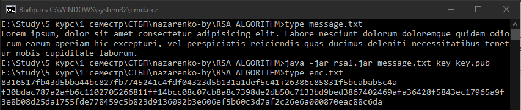
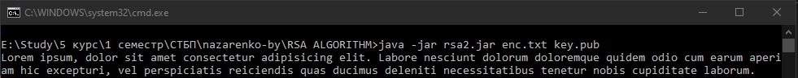

###### Назаренко Б.Є., КІТ М120Б

# RSA ALGORITHM

Лабораторна робота

**Мета** : Дослідити і реалізувати механізм симетричного алгоритму шифрування RSA на основі згеренованих ключів.

**Індивідуальне завдання:**

Розробити додаток обміну таємними посиланнями між двома клієнтами за допомогою алгоритму шифрування RSA.

ХІД РОБОТИ

RSA (абревіатура від прізвищ Rivest, Shamir та Adleman) — криптографічний алгоритм з відкритим ключем, що базується на обчислювальній складності задачі факторизації великих цілих чисел.

RSA став першим алгоритмом такого типу, придатним і для шифрування, і для цифрового підпису. Алгоритм застосовується до великої кількості криптографічних застосунків.

Алгоритм RSA складається з 4 етапів: генерації ключів, шифрування, розшифрування та розповсюдження ключів.

Безпека алгоритму RSA побудована на принципі складності факторизації цілих чисел. Алгоритм використовує два ключі — відкритий (public) і секретний (private), разом відкритий і відповідний йому секретний ключі утворюють пари ключів (keypair). Відкритий ключ не потрібно зберігати в таємниці, він використовується для шифрування даних. Якщо повідомлення було зашифровано відкритим ключем, то розшифрувати його можна тільки відповідним секретним ключем.

Залежно від структури використовуваних ключів методи шифрування поділяються на:

- симетричне шифрування: стороннім особам може бути відомий алгоритм шифрування, але невідома невелика порція секретної інформації - ключа, однакового для відправника і одержувача повідомлення; Приклади: DES, 3DES, AES, Blowfish, Twofish, ГОСТ 28147-89
- асиметричне шифрування: стороннім особам може бути відомий алгоритм шифрування, і, можливо відкритий ключ, але невідомий закритий ключ, відомий тільки одержувачу. Криптографічні системи з відкритим ключем в даний час широко застосовуються в різних мережевих протоколах, зокрема, в протоколах TLS і його попереднику SSL (що лежать в основі HTTPS), а так же SSH, PGP, S / MIME і т.

На даний момент асиметричне шифрування на основі відкритого ключа RSA (розшифровується, як Rivest, ShamirandAldeman - творці алгоритму) використовує більшість продуктів на ринку інформаційної безпеки.

Його криптостойкость грунтується на складності розкладання на множники великих чисел, а саме - на виняткової складності завдання визначити секретний ключ на підставі відкритого, так як для цього буде потрібно вирішити задачу про існування дільників цілого числа. Найбільш криптостійкі системи використовують 1024-бітові і великі числа.

Лістингшифратора:
```

public byte[] encrypt(byte[] source, boolean isLastBlock) {

int[] blocks = CipherUtils.bytesToIntsWithPad(source);

for (int i = 0; i \&lt; blocks.length; i += 2) {

encryptBlock(blocks, i, i + 1);

}

byte[] bytes = CipherUtils.convertIntsToBytes(blocks);

if (isLastBlock) {

int padCount = CipherUtils.paddingSize(source.length);

byte[] tmp = new byte[bytes.length + 1];

System.arraycopy(bytes, 0, tmp, 0, bytes.length);

tmp[tmp.length - 1] = (byte)padCount;

bytes = tmp;

}

return bytes;

}
```

Шифруємо на клієнті №1 повідомлення, результат наведно на рис.1.



Рисунок 1 – Результат

Розшифровуємо на клієнті №2 повідомлення, результат наведно на рис.1.



Рисунок 2 – Результат

**Висновки:** в ході лабораторної работи було досліджено механізм симетричного алгоритму шифрування RSA на основі згеренованих ключів.