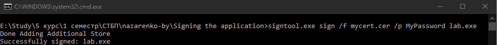
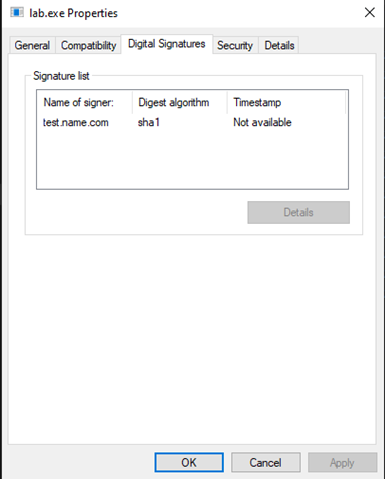
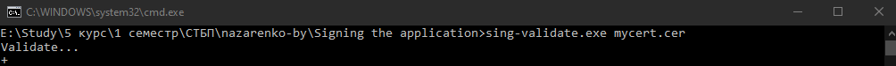

###### Назаренко Б.Є., КІТ М120Б

# ЗАХИСТ ВІД ЗМІНИ БІНАРНОГО ФАЙЛУ

Лабораторна робота

**Мета** : Навчитися підписувати виконувані файли.

**Індивідуальне завдання:**

- створити сертифікат
- проінсталювати його в систему, щоб він був &quot;довіреним&quot;
- використовуючи проект будь-якої попередньої роботи, виконати підпис виконуваного файлу за допомогою утиліти SignTool (або JarSigner) (інші варіанти повиннні бути оговорені з викладачем)
- виконати верифікацію підпису (бажано на рівні самого кода при завантаженні додатка):
  - чи є підписаний сертифікат валідним
  - чи не було (бінарної) зміни файлу та його код цілостний

ХІД РОБОТИ

Підписання коду - це процес цифрового підпису виконуваних файлів і скриптів для підтвердження особи автора програмного забезпечення і гарантії того, що код не був змінений або пошкоджений з моменту його підписання. Публічно довірені сертифікаційні центри (ЦС) підтверджують посвідчення передплатників і пов&#39;язують їх відкритий ключ із сертифікатом підпису коду.

Більшість що продаються сьогодні обчислювальних пристроїв масового ринку поставляються з попередньо завантаженим програмним забезпеченням, але програмне забезпечення, що постачається з пристроєм «з коробки», старіє і часто вимагає оновлення. Для персонального комп&#39;ютера або мобільного пристрою користувачі часто стикаються з ситуаціями, коли їм необхідно завантажити оновлене програмне забезпечення або додаток, Іноді оновлення відбувається в автоматичному режимі. Користувачам рекомендується використовувати додаток на своєму пристрої або відвідуваному їм сайті, щоб, щоб випробувати або використовувати пропоноване їм, їм необхідно оновити, виправити або розширити свій поточний програмне забезпечення. Їх просять прийняти правильне рішення: «Запустити» або «Не запускати».

Виконаємо підпис попередньої лабораторної роботи за допомогою signtool.



Рисунок 1 – Результат підпису

В результаті на рис.2 наведено властивості з підписом файлу.



Рисунок 2 – Підпис файлу

Лістинг валідації підпису:
```

int validate(char \*certificate, char \*url) {

BIO \*certificate\_bio = NULL;

X509 \*cert = NULL;

int valid = 1;

certificate\_bio = BIO\_new(BIO\_s\_file());

if (!(BIO\_read\_filename(certificate\_bio, certificate))) {

fprintf(stderr, &quot;Error in reading cert BIO filename&quot;);

exit(EXIT\_FAILURE);

}

if (!(cert = PEM\_read\_bio\_X509(certificate\_bio, NULL, 0, NULL))) {

fprintf(stderr, &quot;Error in loading certificate&quot;);

exit(EXIT\_FAILURE);

}

if (validate\_dates(cert) == 0 || validate\_domain(cert, url) == 0 ||

validate\_key\_length(cert) == 0 || validate\_key\_usage(cert) == 0) {

valid = 0;

}

X509\_free(cert);

BIO\_free\_all(certificate\_bio);

returnvalid;

}
```

Результат валідації підпису наведено на рис.3.



Рисунок 3 – Результат валідації

**Висновки:** в ході лабораторної работи було отримано навички підпису виконуючих файлів.