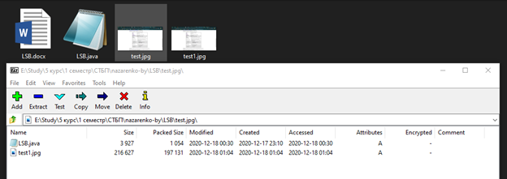
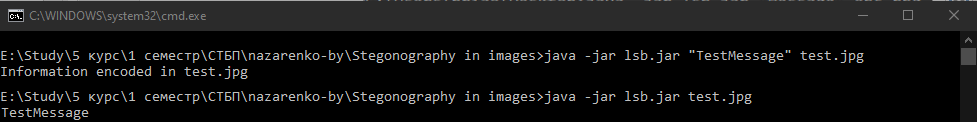

###### Назаренко Б.Є., КІТ М120Б

# ВСТУП ДО СТІГОНОГРАФІЇ

Лабораторна робота

**Мета**** :** Дослідити можливість «приховування» даних у зображеннях

**Індивідуальне завдання**** :**

- Навести реалізацію технології Rar-Jpeg, та продемонструвати її роботу.
- Виконати скриття даних у зображення за допомогою методу найменьш значимих бітів (Less Significant Bits)
- Виконати аналіз скриття даних за допомогою методу стегоаналізу &quot;атака хі квадрат&quot;

ХІД РОБОТИ

RARJPEG - особливий вид файлового контейнера: ілюстрація JPEG, до якої встик (в той же файл) дописаний архів RAR. Залежно від розширення такий файл може сприйматися різними програмами і як ілюстрація JPEG, і як архів RAR. Ця обставина дозволяє, наприклад, використовувати іміджборди (що приймають тільки ілюстрації) в якості анонімних файлових хостингів для архівів.

Лістинг функції, що демонструє rar-jpeg технологію:
```

public void RarJpeg(string containerFilePath, string archivePath, string outputFilePath){

byte[] containerBytes = File.readAllBytes(Paths.get(containerFilePath));

byte[] archiveBytes = File.readAllBytes(Paths.get(archivePath));

byte[] outputBytes = new byte[containerBytes.Length + archiveBytes.Length];

System.arraycopy(containerBytes, 0, outputBytes, 0, containerBytes.Length);

System.arraycopy(archiveBytes, 0, outputBytes, containerBytes.Length, archiveBytes.Length);

FileUtils.writeByteArrayToFile(new File(outputFilePath), outputBytes);

}
```



Рисунок 1 – Результат технології rar-jpeg

Суть методу полягає в наступному: ми замінюємо молодші біти в байтах, які відповідають за кодування кольору. Припустимо, якщо черговий байт нашого секретного повідомлення - 11001011, а байти в зображенні - ... 11101100 01001110 01111100 0101100111 ..., то кодування буде виглядати так. Ми розіб&#39;ємо байт секретного повідомлення на 4 двухбітовий частини: 11, 00, 10, 11, і замінимо отриманими фрагментами молодші біти зображення: ... 11101111 01001100 01111110 0101100111 .... Така заміна в загальному випадку не помітна для людського ока. Більш того, багато старі пристрої виведення, навіть не зможуть відобразити такі незначні зміни.

Лістинг функції, що демонструє скриття данних методом lsb:
```

public static void Encode(String mess, String srcname) throws IOException {

String bin = messtobin(mess) + &quot;00000000&quot;;

File f = new File(srcname + &quot;.png&quot;);

BufferedImage bufferedImage = ImageIO.read(f);

ByteArrayOutputStream bos = new ByteArrayOutputStream();

ImageIO.write(bufferedImage, &quot;png&quot;, bos);

byte[] arr = bos.toByteArray();

int data = HEADER\_SIZE;

char temp;

int x = 0;

if (bin.length() \&gt; (arr.length - HEADER\_SIZE)) {

System.out.println(&quot;message too large for image to hide!&quot;);

} else {

for (int i = 0; i \&lt; bin.length(); i++) {

arr[data] \&gt;\&gt;= 1;

arr[data] \&lt;\&lt;= 1;

arr[data] += (bin.charAt(i) - 48); //

data++;

}

}

File output = new File(srcname + &quot;.png&quot;);

bufferedImage = ImageIO.read(new ByteArrayInputStream(arr));

if (ImageIO.write(bufferedImage, &quot;png&quot;, output)) {

System.out.println(&quot;Information encoded in&quot; + srcname);

}

}
```

На рисунку 2 наведено результат роботи скриття данних.



Рисунок 2 – Результат скриття данних за допомогою метода lsb

Для аналізу скриття даних може використовуватися атака «Хі-квадрат». Атака «Хі-квадрат» грунтується на тому припущенні, що ймовірність одночасної появи сусідніх (відмінних на найменш значущий біт) кольорів (pair of values) в незаповненому стегоконтейнер вкрай мала. Це дійсно так, можеш повірити. Якщо говорити іншими словами, то кількість пікселів двох сусідніх кольорів істотно відрізняється для порожнього контейнера. Все, що нам потрібно зробити, це порахувати кількість пікселів кожного кольору і застосувати пару формул. Насправді, це проста задача на перевірку гіпотези з використанням критерію хі-квадрат.

**Висновки:** в ході лабораторної работи було досліджено приховування даних у зображеннях.