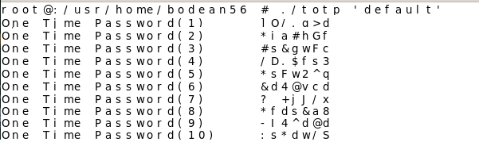

###### Назаренко Б.Є., КІТ М120Б

# TIME-BASED ONE TIME PASSWORD

Лабораторна робота

**Мета** : Дослідити і реалізувати механізм генерації одноразових паролів TOTP.

**Індивідуальне завдання:**

Дослідити алгоритм Time-based One Time Password. Створити програму, що реалізує механізм генерації одноразових паролів TOTP.

ХІД РОБОТИ

**TOTP** (Time-based One-Time Password Algorithm, RFC 6238) — OATH-алгоритм створення одноразових паролів для захищеної аутентифікації, є поліпшенням HOTP (HMAC-Based One-Time Password Algorithm). Є алгоритмом односторонньої аутентифікації — сервер засвідчується в справжності клієнта. Головна відмінність TOTP від HOTP це генерація пароля на основі часу, тобто час є параметром.

**Надійність алгоритму**

Концепція одноразових паролів разом з сучасними криптографічними методами може використовуватися для реалізації надійних систем віддаленої аутентифікації. TOTP досить стійкий до криптографічних атак, проте ймовірність злому є, наприклад можливий такий варіант атаки «людина посередині»:

Прослуховуючи трафік клієнта, зловмисник може перехопити посланий логін і одноразовий пароль (або хеш від нього). Потім йому досить блокувати комп&#39;ютер «жертви» і відправити аутентифікаційні дані від власного імені. Якщо він встигне це зробити за проміжок часу, то йому вдасться отримати доступ. Саме тому варто робити невеликим. Але якщо час дії пароля зробити дуже маленьким, то у разі невеликої розсинхронізації клієнт не зможе отримати доступ.

Також існує вразливість пов&#39;язана з синхронізацією таймерів сервера і клієнта, так як існує ризик розсинхронізації інформації про час на сервері і в програмному та/або апаратному забезпеченні користувача. Оскільки TOTP використовує в якості параметра, то при не збігу значень всі спроби користувача на аутентифікацію завершаться невдачею. У цьому випадку помилковий допуск чужого також буде неможливий. Варто відзначити, що ймовірність такої ситуації вкрай мала.

По суті, TOTP є варіантом HOTP алгоритму, в якому в якості значення лічильника підставляється величина, що залежить від часу. Позначимо:

— дискретне значення часу, що використовується в якості параметра

— інтервал часу, протягом якого дійсний пароль

— початковий час, необхідний для синхронізації сторін

— спільний секрет

— поточний час

T=(*CurrentTime - T0)/X*
HOTP(K,T)=*Truncate*(HMAC-SHA-1(*K,T*))
TOTP=HOTP(*K,T*)

Лістинг генерації TOTP паролю:
```

srand((unsigned int)time(NULL));

for(unsigned long long i = 0; i \&lt; 95; ++i)

{

LOOP:

aucKeysTable[i] = 32 + rand() % 95;

for(unsigned long long j = 0; j \&lt; i; ++j)

{

if(aucKeysTable[j] == aucKeysTable[i]) goto LOOP;

}

}

unsigned long long ulPasswordLength = -1;

while(argv[1][++ulPasswordLength]);

for(unsigned long long i = 1; i \&lt;= AMOUNT; ++i)

{

for(unsigned long long j = 0; argv[1][j]; ++j) argv[1][j] = aucKeysTable[argv[1][j] % 96];

printf(&quot;One Time Password(%llu)\t%s\n&quot;, i, argv[1]);

for(unsigned long long k = 0; k \&lt; 12; ++k)

{

unsigned long long ulKeyIndex, ulKeyTemp, \*pulKeySwap1 = (unsigned long long\*)aucKeysTable, \*pulKeySwap2 = (unsigned long long\*)aucKeysTable;

if(i &amp; 1) ulKeyIndex = argv[1][k % ulPasswordLength] % 12;

else ulKeyIndex = rand() % 12;

ulKeyTemp = pulKeySwap1[k];

pulKeySwap1[k] = pulKeySwap2[ulKeyIndex];

pulKeySwap2[ulKeyIndex] = ulKeyTemp;

}

}
```

Нижче, на рис. 1 наведено результати генерації одноразового паролю TOTP.



Рисунок 1 – Результат

**Висновки:** в ході лабораторної работи було досліджено механізм генерації паролів TOTP.